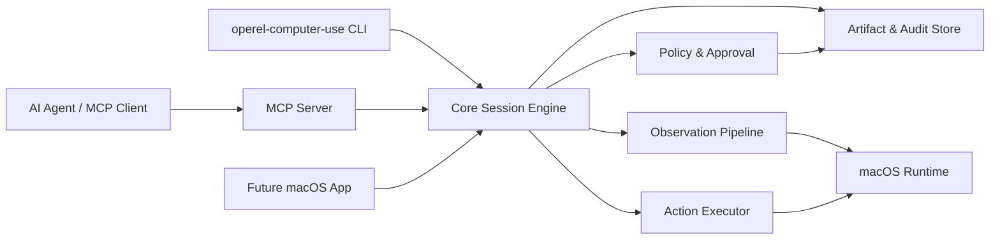

# 系统架构

## 架构概览



## 进程模型

首版建议一个可执行文件提供三种模式：

- `operel-computer-use mcp`：stdio MCP server，给 Agent 调用。
- `operel-computer-use doctor`：权限、签名、runtime 和配置检查。
- `operel-computer-use call <tool>`：本地调试入口，直接调用同一套 core。

后续可以增加原生菜单栏 App，但它不应成为 MCP server 的必需依赖。App 主要负责权限引导、审批 UI、会话监控和安装配置。

入口的完整使用方式见 [入口与使用方式](./entrypoints.md)。Node core 与 Swift helper 的进程协议见 [运行时协议](./runtime-protocol.md)。

## 模块边界

### MCP Adapter

职责：

- 实现 MCP 初始化、tool/resource/prompt 列表和调用。
- 将 MCP JSON schema 映射到 core session command。
- 把结果转换为 MCP text、image、embedded resource 或 structured content。

不负责：

- 直接调用 macOS API。
- 决定安全策略。
- 保存长期状态。

### Core Session Engine

职责：

- 管理 session 生命周期。
- 串行化同一 session 的动作。
- 维护 observation cache、element index、artifact id、step id。
- 统一调用 policy、runtime 和 audit store。

### macOS Runtime

职责：

- 屏幕与窗口观察。
- Accessibility tree 读取。
- 鼠标、键盘、滚动、菜单、app 激活等动作执行。
- 权限状态检查。

### Policy & Approval

职责：

- app allow/deny。
- action risk classification。
- sensitive input detection hook。
- human approval request/response。
- blocked action explanation。

### Artifact & Audit Store

职责：

- 保存 screenshots、accessibility tree snapshots、tool call inputs/outputs、errors。
- 生成可引用 URI：`operel://sessions/{session_id}/artifacts/{artifact_id}`。
- 支持按 session 导出调试包。

## 推荐技术栈

首版建议 Swift + Node 双层：

- Swift Package：macOS runtime，直接使用 ScreenCaptureKit/CoreGraphics、ApplicationServices Accessibility API、CGEvent、NSWorkspace。
- Node/TypeScript CLI：MCP server、JSON schema、配置、日志、跨 Agent 安装命令。
- Swift helper 通过本地子进程 JSON-RPC 或 stdio 协议暴露给 Node core。

理由：

- macOS 权限、窗口和输入 API 用 Swift 更直接，也更利于未来签名和 App 化。
- MCP 生态、CLI 分发和 JSON schema 用 TypeScript 更快。
- 边界清晰后，未来可以把 MCP server 改为纯 Swift 或把 runtime 作为 XPC service。

## 数据流

1. Agent 调用 `observe` 或动作工具。
2. MCP Adapter 校验 schema，创建 `Command`.
3. Core 读取 session 和 policy。
4. 若需要，Core 要求 runtime 激活 app/window。
5. Runtime 执行观察或动作。
6. Core 采集动作后的 screenshot/tree。
7. Store 写入 artifacts 和 audit event。
8. MCP Adapter 返回结构化结果给 Agent。

## 并发模型

- 同一 macOS 用户会话中的真实鼠标键盘、焦点和剪贴板是共享资源，首版默认全局互斥执行动作。
- 观察类工具可以有限并发，但同一 session 内仍应按 step 顺序记录。
- 后台多 Agent 并发不是 MVP；如果未来实现，需要独立虚拟显示、独立 app session、VM 或类似 Codex 的隔离 cursor 能力。

## 配置文件

建议默认路径：

- `~/.operel/computer-use/config.toml`
- `~/.operel/computer-use/sessions/`
- `~/.operel/computer-use/logs/`

示例：

```toml
[server]
transport = "stdio"
max_session_seconds = 1800
default_screenshot_format = "png"

[apps]
allowed = ["TextEdit", "Safari", "Google Chrome", "Simulator"]
denied = ["System Settings", "Keychain Access"]

[policy]
require_confirmation_for_risky_actions = true
redact_sensitive_text_in_logs = true

[artifacts]
retention_days = 14
max_screenshot_width = 1600
```
